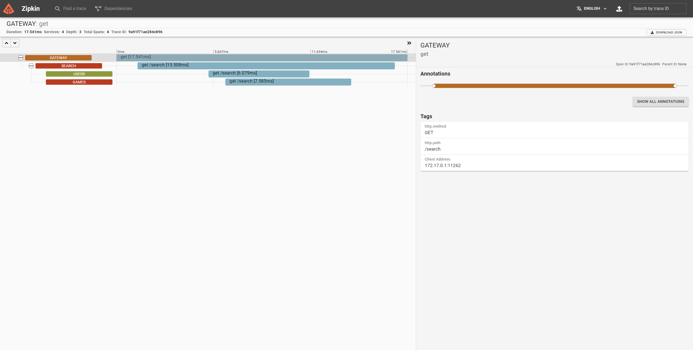

# Project

## Project Idea

The project idea consists of a game library service like Steam or Epic Games Store. The service manages games, users and provides a search to search for different items. A major aspect of the project is the deployment. Every service is deployed including their dependencies (e.g. databases) are deployed inside a Kubernetes cluster. Another major aspect is resilience. The whole system makes use of resilience4j to provide fault tolerance. To monitor the services in the cluster, zipkin was used for distributed tracing.

## Architecture


The architecture consists of four microservices:

* Gateway: Main entry point for the application
* Games Service: Provides information about games (title, description, price, achievements)
* Users Service: Provides information about users and what friends they have, which games they own, which achievements they achieved and how much time they played
* Search Service: Search Interface which allows searching in multiple other services (games and users in this case)

### Services

#### Spring Gateway

To provide a "single point of entry" to the microservice architecture a gateway was implemented using the Spring Cloud Gateway. The configuration was done in the `application.yml` file. In addition to that the Resilience4J CircuitBreaker was setup for the routes of the gateway. This means when a service is unavailable the gateway will immediately short circuit the request when a threshold of requests fail. The routing defined for the users service can be seen below. This redirects all requests starting with `/users` to the users service and strips the prefix using the `StripPrefix` filter.

```yml
spring:
  cloud:
    gateway:
      routes:
        - id: users
          uri: ${USERS_SERVICE}
          predicates:
            - Path=/users/**
          filters:
            - StripPrefix=1
            - CircuitBreaker=users
```

#### Games

The games service manages and provides information about games and the achievements of each game.

For this it provides the following endpoints:

* adding a game
* updating a game
* getting all games
* getting a game by its id
* getting the achievements of a game
* adding an achievement to a game
* updating an achievement
* searching for games (see [Search](#search))

#### Users

The users service is responsible for storing user data like name and email address and his friends. The service also stores which games the user owns, how much playtime he/she has on each game and which achievements he/she achieved for each game.

The users service provides the following endpoints:

* adding a user
* getting all users
* getting a user by its id
* getting the friends of a user
* getting the owned games of a user
* getting the achieved achievements for a user for a game
* getting the playtime of a user for a game
* getting the total playtime of a user
* adding a game to the users owned games
* removing a game to the users owned games
* adding playtime to a game for a user
* adding an achievement to the achieved achievements for a game
* searching for users (see [Search](#search))

#### Search

The search service provides an omni search, which allows to search for a term in multiple services. In the current implementation it searches the games and users services. The services are provided via the config and it is easily possible to add more services in the future. The only requirement for a service to be searchable is the implementation of a `/search` endpoint which receives a query variable `term` and returns a list of results. The requests to the other services are made in parallel. Additionally resilience4j is used (see [Resilience4J](#resilience4j)). Every request is retried three times, each of those requests is also limited to 100ms. In addition to that a circuit breaker was configured which means search queries are not slowed down when one of the services is down.

An example response for the search `F` can be seen below.

```json
[
  {
    "type": "users",
    "results": [
      {
        "name": "Felix",
        "email": "felix.stumvoll@gmail.com",
        "id": 1
      }
    ]
  },
  {
    "type": "games",
    "results": [
      {
        "id": 6,
        "title": "Forza Horizon",
        "description": "lorem ipsum",
        "price": 59.99
      }
    ]
  }
]
```

## Implementation Aspects

### OAuth

All the GET requests of the service can be accessed without authentication or authorization. To prevent unauthorized users from inserting data the endpoints which modify data (e.g. inserting games, adding playtime to a user) are both authenticated and authorized using OAuth using Auth0. For this the secured services (users and games) use the spring security library. The secured endpoints are annotated with `@PreAuthorize("isAuthenticated() and hasAuthority('example:permission')")`. This means users have to provide a bearer token with the correct permissions to be able to interact with the service.

### Build Pipeline

Since Kubernetes deploys pods of docker images the services needed to be built into images. For this a GitHub Actions pipeline similar to the one shown below was set up for each of the 4 services. With the `paths:` section it is configured to be only triggered when the specific service is changed.

```yml
name: Build Games
on:
  push:
    branches:
      - main
    paths:
      - games/**
jobs:
  build-docker:
    runs-on: ubuntu-latest
    steps:
      - name: Checkout
        uses: actions/checkout@v2

      - name: Log in to DockerHub
        uses: docker/login-action@v1
        with:
          username: ${{ secrets.DOCKER_USER }}
          password: ${{ secrets.DOCKER_TOKEN }}
      - name: Build and push
        uses: docker/build-push-action@v2
        with:
          context: ./games
          push: true
          tags: felixstumvoll/gamelib-games:latest

```

This pipeline uses the `Dockerfile` located in each service directory to build a docker image which is pushed to DockerHub. The `Dockerfile` is also responsible to use the correct spring configuration. Each service defines two, one for development and one for production. The production config allows to configure most of the properties through environment variables. The active one is controlled by the `spring.profiles.active` property. Using the following line in the `Dockerfile` it is guaranteed, that the correct profile is used in production.

```dockerfile
RUN sed -i 's/profiles.active:.*/profiles.active: prod/' ./src/main/resources/application.yml
```

### Kubernetes

Kubernetes was used to manage the deployment of the service. However the services were only deployed locally using a `minikube` cluster as a docker container. This has the added benefit, that the cluster can be stopped and started at any time without having to delete and reapply every configuration.

Each service defines a separate configuration which is located in the `.k8s` directory. This consists of:

* service definition
* deployment definition
* config map

The users and games service additionally define the following files for the respective databases:

* database service
* database stateful set
* database config map
* database secret map

In addition to that there are a few common configurations located in the `ops` directory. This includes the configuration of the Zipkin service and the configuration for the OAuth parameters as both should be equal to all services deployed in the cluster. This directory also contains the config for the Zipkin deployment and service.

The deployments use the images created in [Build Pipeline](#build-pipeline) and apply the required environment variables through the config maps and secret maps. Through service definitions the services are exposed to other services. The deployments also use the `Spring Actuator` library which are used as the Kubernetes liveliness probe. For this the following configuration needs to be added to the container definition of the deployment.

```yml
livenessProbe:
  httpGet:
    path: /actuator/health
    port: 8021
  initialDelaySeconds: 100
```

The databases for the users and games service are deployed in the cluster using `StatefulSets`. These are very useful for databases as the storage of a pod does not get destroyed when it gets destroyed. For this the `StatefulSet` defines a `volumeClaimTemplate` which provisions a `PersistentVolume` from a `PersistentVolume` Provisioner. In a cloud environment this would request this volume from the cloud provider, in `minikube` the `PersistentVolume` is mapped to a directory inside the `minikube` container.

The important parts of the k8s configuration of a stateful set can be seen below.

```yml
apiVersion: apps/v1
kind: StatefulSet
metadata:
  name: users-db
spec:
  # selector, replicas, metadata, etc...
  template:
    # metadata
    spec:
      containers:
        - name: users-db
          image: mysql
          # env, ports, etc...
          volumeMounts:
            - name: data
              mountPath: /var/lib/mysql
  volumeClaimTemplates:
    - metadata:
        name: data
      spec:
        accessModes: ["ReadWriteOnce"]
        resources:
          requests:
            storage: 1Gi
```

To access the services provided in the Kubernetes cluster two public endpoints were defined through a load balancer. These two are the gateway and the Zipkin service.

To get a better overview over the cluster and all the running pods, the tool `Lens` was used.


### Resilience4J

To provide fault tolerance between communicating services `resilience4j` was chosen as library.
Specifically the modules `CircuitBreaker`, `Retry` and `Timelimiter` were used.
The setup was sadly not as straight forward as initially thought since resilience4j provides the following different libraries:

* Spring Cloud Configuration
* Spring Boot Annotations
* Spring reactive
* Kotlin Coroutines/Flow Support

This is in addition to the base library of resilience4j for each module (retry, circuit breaker, etc.).
On top of that Spring additional provides two separate libraries for WebMVC and Spring reactive.

The gateway uses the Spring reactive resilience4j library and the search service uses the Kotlin library, as well as the libraries to the base modules (retry, circuit breaker, timelimiter).

The screenshot below shows resilience4j in action. In this case, the users service is down. The screenshot shows, that the request gets retried three times. Each of those retries are limited to 100ms before the request is cancelled, to not make the user wait too long.


Once enough requests to the users service failed the circuit breaker will open and the search service wont send further requests to the users service.


#### Configuration

The gateway is configured using the `application.yml` (as seen below). There is an instance configured for each service. The circuit breaker is then used in the routes definition (see [Spring Gateway](#spring-gateway)).

```yml
resilience4j:
  circuitbreaker:
    configs:
      default:
        slidingWindowSize: 10
        minimumNumberOfCalls: 5
        permittedNumberOfCallsInHalfOpenState: 3
        automaticTransitionFromOpenToHalfOpenEnabled: true
        waitDurationInOpenState: 5s
        failureRateThreshold: 50
    instances:
      users:
        baseConfig: default
      games:
        baseConfig: default
      search:
        baseConfig: default
  timelimiter:
    configs:
      default:
        timeoutDuration: 5s
```

The configuration for the search service is done in code. This is because the search service can call multiple services (defined in the configuration) but each of those services needs its own configuration, otherwise the resilience4j configurations would interfere with one another. The snippet below shows the configuration of `retry`, `circuit breaker` and `retry`. The `$it` variable represents the name of the service and is provided when the configurations are created.

An important configuration aspect is the `ignoreExceptions` in the `retry` configuration.
This prevents retries from happening if the circuit breaker is open. Otherwise the request would still be retried, which would make the circuit breaker pointless.

```kotlin
Retry.of("search-$it", RetryConfig {
    maxAttempts(3)
    ignoreExceptions(CallNotPermittedException::class.java)
});

CircuitBreaker.of("search-$it", CircuitBreakerConfig {
    slidingWindowSize(10)
    minimumNumberOfCalls(5)
    permittedNumberOfCallsInHalfOpenState(3)
    waitDurationInOpenState(Duration.ofSeconds(20))
    failureRateThreshold(50f)
    slowCallDurationThreshold(Duration.ofMillis(350))
    slowCallRateThreshold(50f)
    automaticTransitionFromOpenToHalfOpenEnabled(true)
});

TimeLimiter.of("search-$it",TimeLimiterConfig {
    timeoutDuration(Duration.ofMillis(100))
});        
```

### Distributed Tracing

For distributed tracing `Zipkin` was set up inside the Kubernetes cluster using the `openzipkin/zipkin` docker image. The `spring-cloud-starter-sleuth` and `spring-cloud-sleuth-zipkin` dependencies were added to each service.
This allows the tracing of a request through multiple services as one related request.
In the screenshot below the span of a request to the search service can be seen.



## Conclusion

Spring provides a lot of useful libraries for developing microservice systems. For example the Spring Cloud Gateway, which provides an easily configurable entry point to the system. It also comes with useful functionality like removing prefixes of URLs. Spring also provides integrations for resilience4j which is also a crucial library for developing microservices.

Resilience4J provides multiple modules for fault tolerant communication between multiple microservices. It does so by providing a simple to use API for the developer as well as very fine grained configuration options to customize the behaviour of the library. Resilience4J has also many integrations to different technologies, for example Spring, Kotlin, Spring Cloud Configuration which allows easy integration in any system. On top of that it provides a great documentation.

To be able to comprehend the communication between microservices additional tools are necessary as requests might pass through multiple services before returning. To be able to trace requests through the network, Zipkin is a great addition for a microservice architecture. This tool provides great integration to spring as the only setup requirement was adding the `starter-sleuth` and `sleuth-zipkin` library and providing the service with the Zipkin URL. It than traces all the request and also provides the user with a simple to use UI.

Kubernetes is a very powerful container orchestration tool. It gives the developer fine grained control over how the application should be deployed. Kubernetes provides many tools which cover common needs in microservices architectures like replication through deployments, load balancing with services or defining configuration and secrets in config and secret maps. Although the learning curve of Kubernetes is steep, once understood it is a powerful tool for deploying microservice applications.